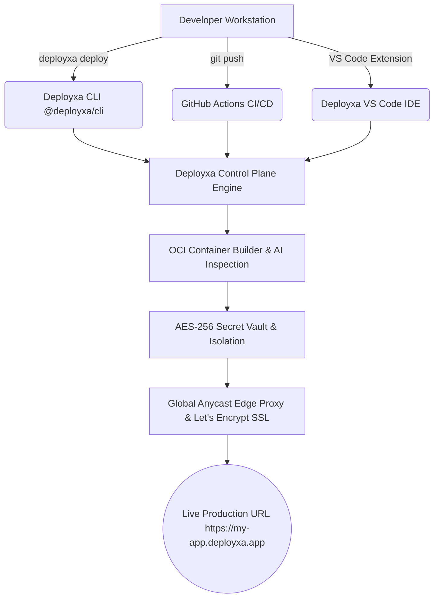

<div align="center">

# Deployxa

### **The AI-Native Cloud Platform for Modern Applications**

[](https://deployxa.com)
[](https://docs.deployxa.com)
[](https://deployxa.com/dashboard)
[](https://www.npmjs.com/package/@deployxa/cli)
[](https://marketplace.visualstudio.com)
[](https://discord.gg/deployxa)
[](https://twitter.com/deployxa)

<p align="center">
  <b>Build, deploy, scale, and manage applications with an AI-powered developer experience.</b><br>
  Deploy containers, APIs, static sites, databases, and full-stack applications from the CLI, VS Code, GitHub, or the Deployxa Dashboard.
</p>

---

</div>

## 🚀 About Deployxa

**Deployxa** is an open-source, AI-native cloud platform built to eliminate infrastructure friction for modern software teams. Instead of spending hours writing complex Kubernetes manifests, configuring Nginx proxies, or wiring Terraform scripts, Deployxa lets developers deploy production-grade workloads in under 60 seconds with a single CLI command (`deployxa deploy`).

### Key Problems Solved
- **No Cloud Vendor Lock-in**: Deploy to bare metal VPS nodes, multi-cloud clusters, or Deployxa Managed Edge Cloud.
- **AI-Powered Containerization**: Automatic framework inspection and multi-stage Dockerfile generation for Next.js, React, Express, FastAPI, Laravel, Django, Nuxt, SvelteKit, and NestJS.
- **Hardware-Backed AES-256 Secret Vault**: Environment secrets are encrypted at rest with zero plaintext disk persistence.
- **Zero-Downtime Rollbacks**: Instantly revert edge proxies to any previous container deployment revision with zero downtime (`deployxa rollback`).

### Who Built Deployxa For?
- 👨‍💻 **Solo Builders & Hobbyists**: Free $0 tier with 3 active projects, custom domains, and free Let's Encrypt SSL.
- 🚀 **Startups & SaaS Founders**: Starter ($12/mo) and Pro ($29/mo) plans with dedicated vCPUs and instant scaling.
- 🏢 **Enterprise & Platform Teams**: Multi-region Anycast CDN, role-based access control (RBAC), and SOC 2 / GDPR compliance controls.

---

## 📦 Our Products

<table width="100%">
  <tr>
    <td width="50%" valign="top">
      <h3>🌩 Deployxa Platform</h3>
      <p>Global cloud engine providing automated OCI container orchestration, anycast routing, Let's Encrypt TLS 1.3 SSL, health gates, and instant horizontal scaling.</p>
      <ul>
        <li>Subsecond cold starts</li>
        <li>Global Anycast CDN proxying</li>
        <li>Automated Let's Encrypt SSL renewals</li>
      </ul>
    </td>
    <td width="50%" valign="top">
      <h3>💻 Deployxa CLI (<code>@deployxa/cli</code>)</h3>
      <p>Developer-first terminal tool for building, deploying, monitoring, and debugging applications directly from your shell.</p>
      <pre><code>npm install -g @deployxa/cli
deployxa login
deployxa deploy --prod</code></pre>
    </td>
  </tr>
  <tr>
    <td width="50%" valign="top">
      <h3>📊 Deployxa Dashboard</h3>
      <p>Modern web console for team organization management, deployment metrics, real-time log streaming, environment secret injection, and AI Copilot assistance.</p>
      <p><a href="https://deployxa.com/dashboard">Launch Console →</a></p>
    </td>
    <td width="50%" valign="top">
      <h3>🔌 Deployxa VS Code Extension</h3>
      <p>Official Visual Studio Code extension integrating real-time container stdout logs, deployment triggers, secret management, and rollback controls inside your editor.</p>
      <p><a href="https://marketplace.visualstudio.com">View on VS Code Marketplace →</a></p>
    </td>
  </tr>
</table>

---

## 📚 Featured Repositories

| Repository | Description | Status |
| :--- | :--- | :--- |
| [**`deployxa-engine`**](https://github.com/deployxa/deployxa-engine) | Core container orchestration control plane, build runners, and edge proxy gateways | `Active` |
| [**`deployxa-dashboard`**](https://github.com/deployxa/deployxa-dashboard) | Next-gen web dashboard, marketing portal, and developer console (`deployxa.com`) | `Active` |
| [**`deployxa-cli`**](https://github.com/deployxa/deployxa-cli) | Official command line interface (`@deployxa/cli`) published on npm | `Active` |
| [**`deployxa-vscode`**](https://github.com/deployxa/deployxa-vscode) | Official Visual Studio Code extension for inline deployments and log streaming | `Active` |
| [**`docs`**](https://github.com/deployxa/docs) | Official developer documentation portal (`docs.deployxa.com`) | `Active` |
| [**`examples`**](https://github.com/deployxa/examples) | Official starter templates for Next.js, React, Express, FastAPI, and Laravel | `Active` |
| [**`sdk-js`**](https://github.com/deployxa/sdk-js) | Official JavaScript / TypeScript SDK for programmatic deployment automation | `Planned` |
| [**`terraform-provider`**](https://github.com/deployxa/terraform-provider) | Official HashiCorp Terraform Provider for Infrastructure-as-Code (IaC) management | `Planned` |

---

## ⚡ Why Developers Choose Deployxa

- 🤖 **AI Copilot Assistant**: Automatically fixes build breakages, missing dependencies, and container port mismatches.
- ⚡ **Subsecond Cold Starts**: Edge proxy containers respond in milliseconds with zero idle compute latency.
- 🔒 **Security First**: Hardware-backed AES-256 secret vault, zero-trust container isolation, and automated Let's Encrypt SSL.
- 🔄 **GitHub CI/CD Automation**: Trigger preview deployments automatically on every pull request or branch push.
- 💻 **CLI & VS Code Native**: Deploy without ever leaving your terminal or code editor.

---

## 🛠 Quick Start (CLI Workflow)

Get your application live on the edge in under 60 seconds:

```bash
# Step 1: Install official Deployxa CLI
npm install -g @deployxa/cli

# Step 2: Authenticate your developer account
deployxa login

# Step 3: Initialize and deploy your project
deployxa deploy --prod
```

> **Prefer a graphical interface?** Deploy directly from the web console at [deployxa.com/dashboard](https://deployxa.com/dashboard) or read our step-by-step guides at [docs.deployxa.com](https://docs.deployxa.com).

---

## 🌐 Open Source Ecosystem Architecture



---

## 🗺 Roadmap Snapshot

### 🟢 Production Available
- ✅ **Deployxa Managed Edge Cloud**: Global container orchestration with subsecond cold starts
- ✅ **Web Dashboard Console**: Full-featured project management, live logs, metrics, and billing
- ✅ **Official CLI (`@deployxa/cli`)**: Machine-readable `--json` output, secret vault management, and rollback controls
- ✅ **Developer Hub (`docs.deployxa.com`)**: Complete framework deployment guides and tutorials
- ✅ **VS Code Extension**: Direct IDE container log streaming and deployment triggers

### 🟡 In Active Development & Coming Soon
- 🔄 **GitHub Actions Runner (`deployxa/deploy-action@v1`)**: Zero-config GitHub marketplace action
- 🔄 **HashiCorp Terraform Provider**: Infrastructure-as-Code provisioner for projects, environments, and custom domains
- 🔄 **JavaScript / TypeScript SDK**: `@deployxa/sdk` for programmatic deployment execution
- 🔄 **Go SDK**: `github.com/deployxa/deployxa-go` for enterprise infrastructure tooling

---

## 👥 Community & Support

Join thousands of developers building on Deployxa:

- 💬 **Discord**: Join our active developer community on [Discord](https://discord.gg/deployxa)
- 🐙 **GitHub Discussions**: Share ideas and ask technical questions in [Deployxa Discussions](https://github.com/deployxa/deployxa-engine/discussions)
- 📰 **Engineering Blog**: Read deep-dive architectural posts on [Deployxa Dispatch](https://deployxa.com/dispatch)
- 🐦 **X (Twitter)**: Follow [@deployxa](https://twitter.com/deployxa) for release announcements

---

## 🤝 Contributing

We welcome open-source contributions to Deployxa! Whether you are fixing a typo in documentation, reporting a bug, writing a framework starter template, or submitting a feature pull request:

- Review our [Contributing Guidelines](https://github.com/deployxa/deployxa-engine/blob/main/CONTRIBUTING.md).
- Check out [Good First Issues](https://github.com/deployxa/deployxa-engine/issues?q=is%3Aissue+is%3Aopen+label%3A%22good+first+issue%22) for new contributors.
- Read our [Code of Conduct](https://github.com/deployxa/deployxa-engine/blob/main/CODE_OF_CONDUCT.md).

---

## 🛡 Security & Responsible Disclosure

Security is a fundamental priority for Deployxa. If you discover a potential security vulnerability, please report it directly through our [Security Disclosure Policy](https://deployxa.com/security) or email `security@deployxa.com`. Please do not open public GitHub issues for security vulnerabilities.

---

## 🎯 Mission Statement

> *"We believe deploying software should be as simple as writing it. Our mission is to give every developer—from solo builders to global enterprises—a fast, secure, and AI-powered platform to build, deploy, and scale applications anywhere."*

<div align="center">

**Built with ❤️ by the Deployxa Open Source Team**  
[Website](https://deployxa.com) • [Documentation](https://docs.deployxa.com) • [Dashboard](https://deployxa.com/dashboard) • [Privacy](https://deployxa.com/privacy) • [Terms](https://deployxa.com/terms)

</div>
